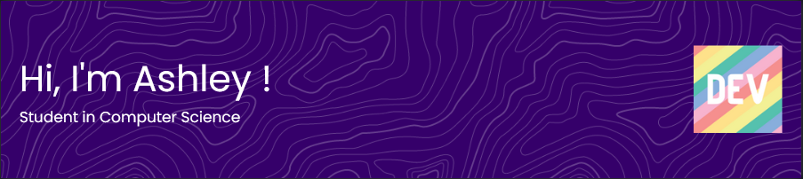

  Hi!

  I'm Ashley, a student at Orsay's IUT, from Paris-Saclay university, 
  and I study computer science. I'm currently in an internship in the 
  CNRS, at IPSL's research center.

*Be aware that these statistics don't analyze some of my private and school projects that aren't hosted on GitHub.*

## About me

If you want more info, just check out my [website](https://sillyash.github.io) ! It may be outdated but I show you my last updates on each section of the site.

 

 

If you have any questions or inquiries, contact me directly on GitHub or on LinkedIn.
