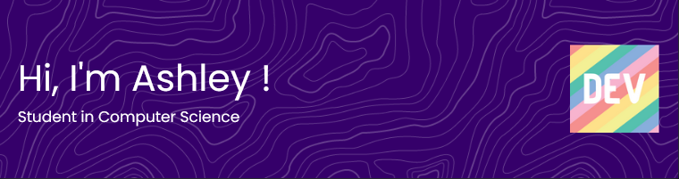

## Introduction

| My tools      | My languages  | My languages (web) | My OS's       | My collaboration tools |
| :--------------: | :--------------: | :----------------: | :----------------: | :--------------------: |
|   |  |  |  |  |
|   |  |  |  |  |
|  |  |  |  |  |
|  |  |  |  |  |

I'm currently a student of Orsay's IUT (from ```Paris-Saclay``` university), and I study Computer Science! I've also studied computer science in Highschool.

I'm a french native speaker, but I'm as fluent in English, sometimes even better in english when it comes to IT.

I've learned a lot of ```Python``` ```HTML``` and ```CSS```. I also cover the basics of ```C++``` and ```Java```.

I'm currently learning ```Java``` ```JavaScript``` and  ```C++```

[](https://github.com/sillyash/github-readme-stats)

*Be aware that these statistics don't take some of my private and school projects that aren't hosted on GitHub.*


## About me

As you have probably seen, I'm a curious person when it comes to languages, and I want to try a lot of them before I finish my studies. I'm a fast learner and I've noticed that it gets easier the more I learn.

Of course, I'm not aiming to be a very good or expert developer in all of these languages, but learning the basics of a lot of languages might help me figure out which ones I want to work with in the long term.

I'm getting quite good using ```C++``` and it's libraries, but I'm also enjoying ```Java```, which have two very different philosophies for coding.

Frontend developing is quite fun, but I really like backend. However, if I could, I'd choose to make backend and still have a bit of control over frontend: that's why I think WebAssembly and React are extremely efficient and practical tools when it comes to this, and I wish to have the opportunity to learn about them soon.

I've done a lot of ```SQL``` and ```CDM/Database``` construction for school projetcs, as well as installing and setting up a ```MariaDB``` database on a ```Raspberry Pi```.

When it comes to my IT culture, I would say I encourage and like Open Source and Free Software a lot, but I love to participate in anything, really.

I'm both a Windows and GNU/Linux user, and I try to keep up with security and privacy when it comes to technology: that's why I'm using ```Kali``` and ```Arch/Manjaro```.

Concerning the OS I use, I use GNU/linux daily on my laptop (I have dual boot with Kali/Manjaro). I use Windows on my desktop at home. I'm a shell user on all the OS i use, especially Linux, so I'm comfortable using whatever shell or terminal.

<br>


<br>

If you have any questions or inquiries, contact me directly on GitHub or on LinkedIn.
